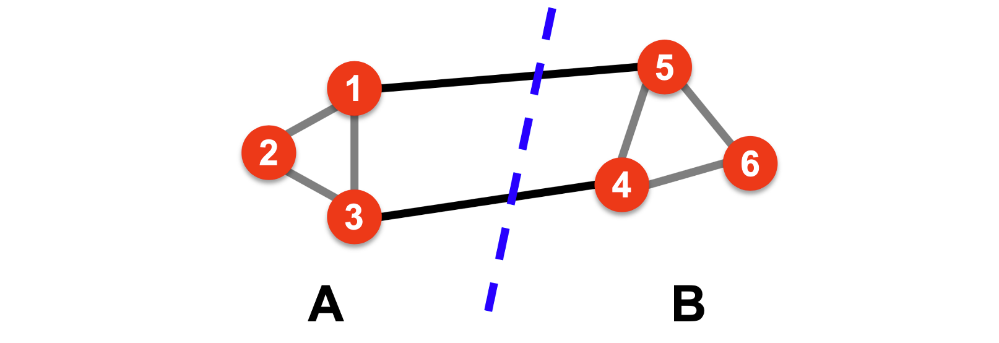
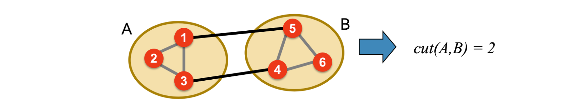
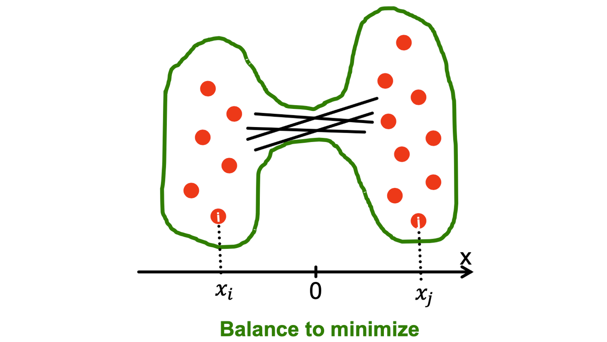

## Introduction and Graph Cut

Suppose we have an undirected graph $G(V,E)$, and we would like to perform a bi-partitioning task on the graph, i.e., dividing vertices in $V$ into two disjoint groups $A$ and $B$.

How to define a good partition?

1. Maximize the number of within-group
   connections.
2. Minimize the number of between-group connections.

   

 

Definition (Graph Cuts): Set of edges with one endpoint in each group:

$$cut(A,B)=\Sigma_{i\in A, j\in B}w_{ij}$$

where, if the graph is weighted $w_{ij}$ is the weight, otherwise, all $w_{ij}\in \{0,1\}$.

 

At this point, we first focus on the unweighted graph.

So, what is a good graph cut criterion?
### Minimum-cut: Minimize weight of connections between groups.

$$\arg \min_{A,B}cut(A,B)$$
    

- Only considers external cluster connections.

- Does not consider internal cluster connectivity.

### Conductance: Connectivity between groups relative to the density of each group.

$$\Phi(A,B)=\frac{cut(A,B)}{\min(vol(A),vol(B))}$$

where $vol(A)$ = total degree of the nodes in $A$ = number of edge end points in A. And we are trying to find the minimal conductance.

Advantages: Conductance produces more balanced partitions. The reason is as following: The total number of edges in the graph $G$ is fixed. After bi-partitioning, we split the total degree of all nodes in $G$ into two parts, and take the smaller one among these two as the denominator of the conductance. Therefore, a smaller conductance tends to give us a more balanced partition.

## Graph Laplacian matrix

There are three main matrix representations that we care about: Adjacency matrix, degree matrix, and laplacian matrix.

**Adjacency matrix ($A$)**: $A$ is a $n \times n$ matrix, where $n = \|V\|$, and it defines as:

   $A = [a_{ij}], a_{ij} = 1$ if there is an edge between $i$ and $j$, otherwise, $a_{ij} = 0$.

   There are some important properties of an ajacency matrix $A$: (1) Symmetric matrix, (2) Has $n$ real eigenvalues, (3) Eigenvectors are real-valued and orthogonal.

   **Spectral Graph Theory**: Analyze the “spectrum” of matrix representing $G$.

   Definition (Spectrum): Eigenvectors $x^{(i)}$ of a graph ('s ajacency matrix $A$), ordered by the magnitude (strength) of their corresponding eigenvalues $\lambda_i$: $\Lambda = \{\lambda_1,\lambda_2,\cdots,\lambda_n\}$, where $\lambda_1\leq \lambda_2 \leq \cdots \leq \lambda_n$.

   **Degree matrix ($D$)**: $D$ is a $n \times n$ matrix, where $n = \|V\|$, and it defines as:

    $D = [d_{ii}], d_{ii} =$ degree of node $i$, other elements of $D$ are all $0$.

   **Laplacian matrix ($L$)**: $L$ is defined as, another $n \times n$ matrix, the difference between $D$ and $A$, i.e., $L = D - A$.

   Note that there is a trivial eigenpair for a laplacian matrix $L$: $x=(1,\cdots,1)$ then $L\cdot x=0$ and so $\lambda=\lambda_1 \text{(smallest eigenvalue)} = 0$.

   There are some important properties of a laplacian matrix $L$: (1) Eigenvalues are non-negative real numbers, (2) Eigenvectors are real (and always orthogonal)

   

Let's denote $\lambda_2$ as an optimization problem, where $\lambda_2$ is the second smallest eigenvalue for a symmetric matrix $M$. We have the following fact:

$$\lambda_2=\min_{x:x^Tw_1=0}\frac{x^TMx}{x^Tx}$$

where $w_1$ is the eigenvector corresponding to the smallest eigenvalue $v_1$.

So now we can consider what is the meaning of $\min x^TLx$ on the graph $G$.

$$
\begin{aligned}
x^TLx &=\Sigma^n_{i,j=1}L_{ij}x_ix_j \\
&=\Sigma^{n}_{i,j=1}(D_{ij}-A_{ij})x_ix_j \\
&=\Sigma_iD_{ii}x^2_i-\Sigma_{(i,j)\in E}2x_ix_j\\
& =\Sigma_{(i,j)\in E}(x^2_+x^2_j-2x_ix_j) \\
&=\Sigma_{(i,j)\in E}(x_i-x_j)^2 \\
\end{aligned}
$$

We also know that $x$ has another two properties:

1. $x$ is unit vector, i.e., $\Sigma_ix^2_i=1$

2. $x$ is orthogonal to the eigenvector $[1,\cdots, 1]$. Therefore, $\Sigma_ix_i\cdot 1=\Sigma_ix_i=0$

    

Up to this point, we can convert the original fact about $\lambda_2$ to be:

$$
\begin{aligned}
\lambda_2&=\min_{\text{All labelings of nodes $i$ so that $\Sigma_i x_i = 0$}}\frac{\Sigma_{(i,j)\in E}(x_i-x_j)^2}{\Sigma_ix^2_i} \\
&=\min_{\text{All labelings of nodes $i$ so that $\Sigma_i x_i = 0$}}\Sigma_{(i,j)\in E}(x_i-x_j)^2
\end{aligned}
$$

So, we want to assign values $x_i$ to nodes $i$ such that few edges cross $0$. (we want $x_i$ and $x_j$ to subtract each other)

   
   

### Rayleigh Theorem

$$\min_{y\in\mathbb{R}^n:\Sigma_iy_i=0, \Sigma_iy^2_i=1}f(y)=\Sigma_{(i,j)\in E}(y_i-y_j)^2=y^TLy$$

1. $\lambda_2 = \min_yf(y)$: The minimum value of $f(y)$ is given by the second smallest eigenvalue $\lambda_2$ of the Laplacian matrix $L$.
2. $x = \arg\min_yf(y)$: The optimal solution for $y$ is given by the eigenvector $x$ corresponding to $\lambda_2$, referred to as the Fiedler vector.
3. __We can use the sign of $\mathbf{x_i}$ to determine cluster assignment of node $\mathbf{i}$__.
   
   
---

# Algorithm

## 2-Way spectral clustering

### Procedure

1. Compute the Laplacian matrix $L$ of the graph.

2. Compute the eigenvectors and eigenvalues of $L$. Sort the eigenvalues by $\lambda_1\leq \lambda_2 \leq \dots$.

3. Choose splitting points

   - Naive approach: split at 0. Assign labels to vertices based on the sign of coordinates of $\lambda_2$

### Theoretical Guarantee

The **conductance** of a subset $S\subset V$ can be defined as
$$
\phi(S)=\frac{|E(S, \bar{S})|}{d\min\left\{|S|, |\bar{S}|\right\}}
$$
where $E(S, \bar{S})$ denotes the set of edges of $G$ crossing from $S$ to its complement.

The conductance of the graph $G$ is defined as
$$
\phi(G) = \min_{S\subset V}\phi(S)
$$

which is a way of measuring the performance of a particular partition of the graph.

**Cheeger's inequality**

Cheeger's Inequality provides a worst-case performance guarantee for spectral clustering, which states that for any graph $G$,
$$
\frac{\lambda_2}{2} \leq \phi(G) \leq \sqrt{2\lambda_2}
$$

The inequality relates the property of conductance to $\lambda_2$. It implies that if $\lambda_2$ is small, the graph is partitionable. If $\lambda_2$ is large, the graph is not partitionable. 

We can see that using the above eigenvector approach, the 2-way spectral clustering algorithm is able to find a cut that has at most **twice** the conductance as the optimal one of conductance $\phi(G)$.

---

## k-way spectral clustering

### Procedure

One approach: Apply 2-way repeatedly until a total of $k$ clusters have been found.
Another approach: 

**Unnormalized**

1. Compute the first $k$ eigenvectors $\lambda_1,\dots, \lambda_k$ of $L$.

2. Let $U\in \mathcal{R}^{n\times k}$ be the matrix containing $\lambda_1,\dots, \lambda_k$ as columns.

3. Let $y_i\in \mathcal{R}^k$ with $i=1, \dots, n$ be the vector corresponding tot he $i$-th row of $U$.

4. Cluster the points $(y_i)_{i=1, \dots, n}$ using the k-means algorithm into clusters $C_1, \dots, C_k$.

5. Output the clusters of vertices $A_1, \dots, A_k$ with $A_i=\left\{j\|y_j\in C_i\right\}$.

   

**Normalized**

1. Compute the first $k$ generalized eigenvectors $\lambda_1,\dots, \lambda_k$ of the generalized eigenproblem $L\lambda =\alpha D \lambda$ ($D$ is the degree matrix).
2. The rest are the same.

### Theoretical Guarantee

**Graph cut point of view**

The simplest and most direct way to construct a partition of the graph is to solve the mincut problem, which consists in choosing a partition $A_1, \dots, A_k$  minimizing
    
$$
\text{cut}(A_1, \dots, A_k)=\frac{1}{2}\sum_{i=1}^k W(A_i, \bar{A}_i)
$$

where $\bar{A}$ denotes the complement of $A$ and $W(A,B)=\sum_{i\in A, j\in B}w_{ij}$.

**Problem:** In many cases, the solution of mincut simply separates one individual vertex from the rest of the graph, but clusters should be reasonably large groups of points. To encode this problem, two most common objective functions are RatioCut and normalized cut Ncut.
    
$$
\text{RatioCut}(A_1, \dots, A_k)=\frac{1}{2}\sum_{i=1}^k \frac{W(A_i, \bar{A_i})}{|A_i|}=\sum_{i=1}^k\frac{\text{cut}(A_i, \bar{A_i})}{|A_i|}\\\text{Ncut}(A_1,\dots,A_k)=\frac{1}{2}\sum_{i=1}^k \frac{W(A_i,\bar{A_i})}{\text{vol}(A_i)}=\sum_{i=1}^k \frac{\text{cut}(A_i, \bar{A_i})}{\text{vol}(A_i)}
$$

**RatioCut**

Given a partition of $V$ into $k$ sets $A_1, \dots, A_k$, we define $k$ indicator vectors,  $h_j=\begin{bmatrix} h_{i,j} & \dots & h_{n,j}\end{bmatrix}^T$, where each vector has $n$ dimension, by
    
$$
h_{i,j}=\left\{ \begin{aligned} \frac{1}{\sqrt{|A_j|}} \quad& v_i\in A_j  \\ 0 \quad& \text{otherwise} \end{aligned} \right. \qquad i=1,\dots, n;j=1, \dots,k \quad (1)
$$

Construct a matrix $H\in \mathcal{R}^{n\times k}$ as the matrix containing those $k$ indicator vectors as columns. The columns in $H$ are orthonormal to each other $\rightarrow$ $H^{'}H=I$

Since
    
$$
\begin{aligned}(H^{'}LH)_{ii}=h_i^{'}Lh_i &=\frac{1}{2}\sum_{p,q=1}^n w_{pq}(h_{p,i}-h_{q,i})^2\\&=\frac{1}{2}\sum_{v_p\in A_i, v_q\in \bar{A_i} || v_p\in \bar{A_i}, v_q\in A_i}w_{pq}(\frac{1}{\sqrt{|A_i|}})^2\\&=\frac{\text{cut}(A_i, \bar{A_i})}{|A_i|}\end{aligned}
$$

Therefore,
    
$$
\text{RatioCut}(A_1,\dots, A_k)=\sum_{i=1}^k h_i^{'}Lh_i=\sum_{i=1}^k(H^{'}LH)_{ii}=Tr(H^{'}LH)
$$

The problem of minimizing $\text{RatioCut}(A_1,\dots, A_k)$ can be written as
    
$$
\min_{A_1,\dots, A_k}Tr(H^{'}LH)\quad \text{s.t.} \quad H^{'}H=I
$$

$H$ is defined in (1).

Relax the problem as:
    
$$
\min_{H\in \mathcal{R}^{n\times k}} Tr(H^{'}LH) \quad \text{s.t.} \quad H^{'}H=I
$$

where entries of $H$ can take arbitrary real values.
    

Rayleigh-Ritz theorem says that the solution is given by choosing $H$ as the matrix which contains the first $k$ eigenvectors of $L$ as columns, which is in fact the matrix $U$ mentioned in "Procedure" section.

**NCut**

Define the indicator vectors,  $h_j=\begin{bmatrix} h_{i,j} & \dots & h_{n,j}\end{bmatrix}^T$, where each vector has $n$ dimension, by
    
$$
\begin{equation}h_{i,j}=\left\{ \begin{aligned} \frac{1}{\sqrt{vol(A_j)}} \quad& v_i\in A_j  \\ 0 \quad& \text{otherwise} \end{aligned} \right. \qquad i=1,\dots, n;j=1, \dots,k \quad (2)\end{equation}
$$

Construct a matrix $H\in \mathcal{R}^{n\times k}$ as the matrix containing those $k$ indicator vectors as columns. The columns in $H$ are orthonormal to each other $\rightarrow$ $H^{'}DH=I$. Then, we have
    
$$
(H^{'}LH)_{ii}=h_i^{'}Lh_i =\frac{\text{cut}(A_i, \bar{A_i})}{vol(A_i)}
$$

as above. So the problem of minimizing Ncut can be formulated as
    
$$
\min_{A_1,\dots, A_k}Tr(H^{'}LH)\quad \text{s.t.} \quad H^{'}DH=I
$$

$H$ is defined in (2).

Relax the problem and substituting $T=D^{1/2}H$, we have
    
$$
\min_{H\in \mathcal{R}^{n\times k}} Tr(T^{'}D^{-1/2}LD^{-1/2}T) \quad \text{s.t.} \quad T^{'}T=I
$$

This can also lead to the solution $H$ consisting of the first $k$ generalized eigenvectors of $L\lambda =\alpha D \lambda$, corresponding the the normalized spectral clustering algorithm.

---

### Time Complexity

1. $O(n^3)$ → find the eigenvalues and eigenvectors

2. Fast approximate spectral clustering https://people.eecs.berkeley.edu/~jordan/papers/yan-etal-long.pdf

   $O(k^3)+O(knt)$, where $t$ is the number of iterations

    

    

## Multi-way ($k$-way) spectral clustering

Intuitively, we can perform a $k$-way spectral clustering by recursively applying the $2$-way partitoning algorithms as mentioned above. However, the higher-order spectral information is not utilized in this case. There are several algorithms proposed for multi-way spectral partitioning by minimizing the generalized normalized cut and graph expansion.

__Generalized normalized cut__: Suppose $S_1, S_2, \ldots, S_k$ denotes a $k$-partiton of $G$, then the $k$-way normalized cut is defined as 
$$
N_{c u t, k}(S)=\sum_{i=1}^{k} \frac{\left|E\left(S_{i}, \bar{S}_{i}\right)\right|}{d\left(S_{i}\right)}.
$$

Based on the $k$-way normalized cut, [Shi and Malik (2000)][1](https://people.eecs.berkeley.edu/~malik/papers/SM-ncut.pdf) proposes a greedy algorithm which iteratively minimize the $k$-way normalized cut to find the optimal $k$ partition sets $S_1, \ldots, S_k$. Given the adjacency matrix as input, the main procedure is described as follows:

1. Compute the unnormalized Laplacian $L$.

2. Compute the $n$ eigenvectors $u_1, \ldots, u_n$ by solving the generalized eigenproblem $Lu = \lambda D u$.

3. Let $U \in \mathbb{R}^{n \times n}$ be the matrix containing $u_1, \ldots, u_n$ as columns, and $y_i \in \mathbb{R}^{n}$     be the vector corresponding to the $i$-th row of $U$.

4. Apply $k$-means algorithm to cluster $y_i, i = 1, \ldots, n$ into $k' \ge k$ clusters, and greedily merge clusters such that the normalized cut is minimized, until there are only $k$ clusters left.

[Ng et al. (2002)][2](https://papers.nips.cc/paper/2001/file/801272ee79cfde7fa5960571fee36b9b-Paper.pdf) also proposes a similar algorithm, however, it leverages the symmetric normalized Laplacian matrix $L_{sym} = I - D^{-1/2} A D^{-1/2}$. Given the adjacency matrix as input, the details are shown as below.

1. Compute the symmetric normalized Laplacian matrix $L_{sym}$.

2. Compute the first $k$ eigenvectors $u_1, \ldots, u_k$ by solving the eigenproblem $L_{sym} u = \lambda u$.

3. Let $U \in \mathbb{R}^{n \times k}$ be the matrix containing $u_1, \ldots, u_k$, and construct matrix $T \in \mathbb{R}^{n \times k}$ by normalizing $U$ (i.e., $T_{i j} = U_{i j}/(\sum_{k} U_{i k}^2)^{1/2}$).

4. Let $y_i \in \mathbb{R}^{n}$ be the vector corresponding to the $i$-th row of $T$. Apply $k$-means algorithm to cluster $y_i, i=1,\ldots, n$ into $k$ clusters. 

Although the algorithms mentioned above achieves great performance empirically, they are heuristic and lack theoretical support. Recently, [Lee et al. (2012)][3](https://arxiv.org/pdf/1111.1055.pdf) generalized the Chegger inequalities to higher-order eigenvalues, and theoretically demonstrate why $k$-way spectral clustering algorithms work well. In particular, let $\phi_{G}(S)$ denote the expansion of $S$ for any subset $S \subseteq V$, and 
$$
    \phi_{G}(S)=\frac{|E(S, \bar{S})|}{d|S|},
$$

    where $E(S, \bar{S})$ denotes the set of edges of $G$ crossing from $S$ to its complement. The $k$-way expansion constant for every $k \in \mathbb{N}$ is defined as

$$
    \rho_{G}(k)=\min _{k-\text{partition} S_{1}, S_{2}, \ldots, S_{k}} \max \left\{\phi_{G}\left(S_{i}\right): i=1,2, \ldots, k\right\},
$$

    where the minimum is taken over all the collections of $k$ non-empty, disjoint subsets $S_1, S_2, \ldots, S_k \subseteq V$. Then the significant result is given as follows:

__Theorem__: For every graph $G$, and every $k \in \mathbb{N}$, we have
$$
    \frac{\lambda_{k}}{2} \leq \rho_{G}(k) \leq O\left(k^{2}\right) \sqrt{\lambda_{k}}.
$$

Through the derivation procedure of the proof, a randomized algorithm for finding the optimal $k$ partitions is derived, and we describe it as follows.

1. __Spectral Embedding__: Compute the first $2k$ eigenvectors $f_i, i = 1,\ldots, 2k$ by solving the generalized eigen-problem $Lf = \lambda D f$, and let $F(v) = [f_1(v), f_2(v), \ldots, f_{2k}(v)], v \in V$ be the embedding of node $v$. 

2. __Random Projection__: Define $h = O(\log k)$, and perform random projection of the vertex embeddings $F(v)$ from $\mathbb{R}^{2k}$ to $\mathbb{R}^{h}$. Specifically, let $\Gamma_{2 k, h}: \mathbb{R}^{2 k} \rightarrow \mathbb{R}^{h}$ be a random linear mapping given by the dot product of the embedding and $h$ i.i.d. Gaussian vectors (i.e., $\Gamma_{2 k, h}(x)=\frac{1}{\sqrt{h}}\left(\left\langle g_{1}, x\right\rangle, \ldots,\left\langle g_{h}, x\right\rangle\right)$), and then we have for each $v \in V$, 

$$
F^{*}(v)=\frac{1}{\sqrt{h}}\left(\left\langle g_{1}, F(v)\right\rangle, \ldots,\left\langle g_{h}, F(v)\right\rangle\right).
$$

3. __Random Partitioning__: Determine some constant $m$, and randomly sample $r$ points $x_1, \ldots, x_m$ from the unit ball in $\mathbb{R}^{h}$, which served as "anchor points" (or "centroids"). Each $x_i$ can be regarded as the anchor point of cluster $i$, and we assign each vertex $v \in V$ to its closest anchor point, and the distance is measured by $\| x_i - \frac{F^{*}(v)}{\| F^{*}(v) \|} \|$. Now we have $m$ partitions $S_1 \cup S_2 \cup \ldots \cup S_m = V$.

4. __Merging__: For a subset $S \subseteq V$, define $\mathcal{M}(S) == \sum_{v \in S} w(v) \| F^{*}(v) \|^2$. 
Sort ${S_1, \ldots, S_m}$ in descending order based on $\mathcal{M}(S_i)$. Let $k' = \lceil \frac{3}{2}k \rceil$, and then for $j = k'+1, \ldots, m$, iteratively merge $S_j$ to the set with smallest $\mathcal{M}(S_i), i\le k'$. 

5. __Chegger Sweep__: Foe $i = 1, \ldots, k'$, choose a threshold $\tau$ such that
   $$
   \hat{S}_{i}=\left\{v \in S_{i}:\left\|F^{*}(v)\right\|^{2} \geq \tau\right\}
   $$   
   
has the least expansion value. Then we select $k$ of the sets $\hat{S}_{1},\hat{S}_{2},\ldots, \hat{S}_{k}$ that have the smallest expansion.

## Examples

### Synthetic experiments

<image src = "images/improved_sc.png" width="500">

### Real-world experiments

- [1][test](baidu.com)
